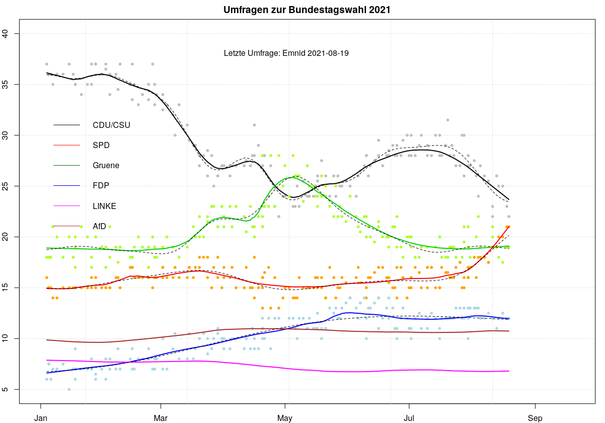

### Institute und letzte Umfragen

Eine Auswertung der Umfragen zur Bundestagswahl am 26. September 2021.

Stand: **27. August 2021**
*(Die Graphik wird in etwa jede Woche aktualisiert)*

Für die Umfragen der Wahlforschungs-Institute nutzen wir die veröffentlichten Daten auf [wahlrecht.de](https://www.wahlrecht.de/) ab Januar 2021.\
Die acht beteiligten Institute sind:

| Institut                 | Auftraggeber                    | # Umfragen |
|:-------------------------|:--------------------------------|-----------:|
| Allensbach               | FAZ                             |          8 |
| Kantar Emnid             | BamS                            |         32 |
| Forsa                    | stern-RTL                       |         35 |
| Forschungsgruppe Wahlen  | ZDF Politbarometer              |         12 |
| GMS                      | SAT1                            |          6 |
| Infratest Dimap          | ARD Deutschlandtrend            |         15 |
| INSA                     | Bild                            |         52 |
| YouGov                   | Redaktionsnetzwerk Deutschland  |          8 |

Die letzten 6 Umfragen haben zu folgenden Ergebnissen geführt:

|      Datum | CDUCSU | SPD | Gruene |  FDP | LINKE | AfD |  Institut |
|:-----------|-------:|----:|-------:|-----:|------:|----:|----------:|
| 2021-08-11 |     23 | 19  |   20.0 | 12.0 |   7.0 |  10 |     Forsa |
| 2021-08-13 |     26 | 19  |   19.0 | 11.0 |   7.0 |  11 | ForWahlen |
| 2021-08-14 |     25 | 20  |   18.0 | 12.0 |   7.0 |  11 |      INSA |
| 2021-08-16 |     25 | 20  |   17.5 | 12.5 |   6.5 |  11 |      INSA |
| 2021-08-18 |     23 | 21  |   19.0 | 12.0 |   6.0 |  10 |     Forsa |
| 2021-08-19 |     22 | 21  |   19.0 | 12.0 |   7.0 |  11 |     Emnid |

Die Daten werden jeweils aktuell und online aus den Tabellen auf 'wahlrecht.de' gezogen und mit R weiter verarbeitet. Die Grahik wird mit Base R Plot Routinen erzeugt (eine interaktive Version mit 'ggplo2' und 'plotly' könnte folgen).

### Glättung der Umfrage-Ergebnisse

Die folgende Grafik zeigt Ergebnisse der einzelnen Umfragen für die Parteien und Gättungskurven für den Verlauf. Die durchgezogenen Linien folgen Friedman's *Supersmoother* (in R als Funktion `supsmu`), die gestrichelten Linien durch *Gauss'sche Prozesse* berechnete Approximationen (die besonders am Ende unterschiedlich sein können).

(Die Einzelergebnisse für AfD und DieLinke sind nicht eingezeichnet, um die Grafik im unteren Bereich nicht zu überlasten.)

### Stimmen und Koalitionen

Aus diesen letzten Ergebnissen ergibt sich folgende Schätzung der prozentualen Stimmen und der Stimmenverteilung.

| Partei    | Anteil Stimmen | Sitze Bundestag|
|----------:|---------------:|---------------:|
| CDU/CSU   | 24 % | 181 |
| SPD       | 21 % | 155 |
| B90/Grüne | 19 % | 141 |
| FDP       | 12 % |  89 |
| DieLinke  |  7 % |  52 |
| AfD       | 11 % |  82 |
| Sonstige  |  6 % |   - |

Die Sitzverteilung ist dabei gerechnet mit etwa 700 Plätzen im Bundestag und 6% abgegebener Stimmen für Parteien, die wegen der 5%-Hürde *nicht* in den Bundestag kommen. Die wahrscheinlich hohe Zahl an Überhangmandaten für die CDU/CSU wird nicht berücksichtigt.

Die "grosse Koalition" hat keine Mehrheit mehr (336/700), ebenso hätte eine Linkskoalition von SPD, Grünen und Linken knapp keine Mehrheit (348/700). Am wahrscheinlichsten erscheint eine Jamaika- oder Deutschland-Koalition.

| Koalition | Parteien | Anzahl stimmen | Bemerkung |
|:----------|:---------|:---------------|:----------|
| Ampel Koalition | SPD, Grüne, FDP | 385 | von der FDP abgelehnt |
| Jamaika Koalition (*) | CDU/CSU, Grüne, FDP | 411 |  |
| Deutschland Koalition | CDU/CSU, SPD, FDP | 425 |  |
| Kenia Koalition | CDU/CSU, SPD, Grüne | 477 | zu grosse (?) Mehrheit |
| Linkskoalition | SPD, Grüne, DieLinke| 348 | z.Z. keine Mehrheit|
| Grosse Koalition | CDU/CSU, SPD | 336 | keine Mehrheit |

(*) auch "schwarze Ampel" oder kurz "Schwampel" genannt.

