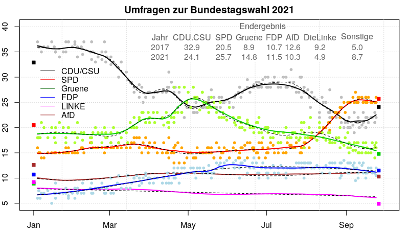
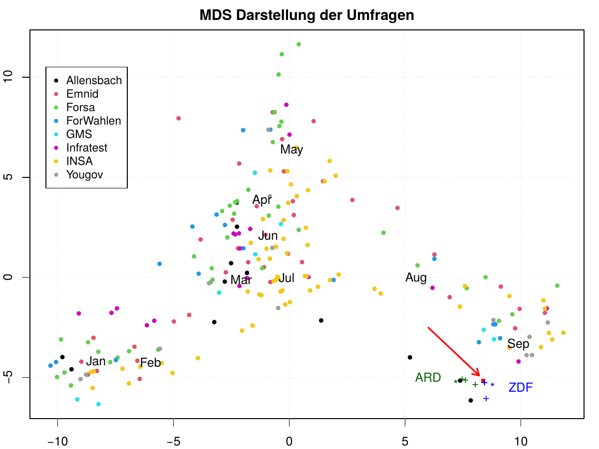

# Umfragen zur Bundestagswahl 2021

Hans W. Borchers\
*September 2021*

### Institute und letzte Umfragen

Eine Auswertung der Umfragen zur Bundestagswahl am 26. September 2021.

Stand: **Wed., 26. Sept. 2021** *(Die Graphik wird nicht mehr weiter aktualisiert)*

Für die Umfragen der Wahlforschungs-Institute nutzen wir die veröffentlichten Daten auf [wahlrecht.de](https://www.wahlrecht.de/) ab Januar 2021.\
Die acht beteiligten Institute sind:

| Institut                | Auftraggeber                   | \# Umfragen 2021 |       Art der Umfragen |
|:------------------------|:-------------------------------|-----------------:|-----------------------:|
| Allensbach              | FAZ                            |               12 | 'Face-to-face', \~1500 |
| Kantar Emnid            | BamS                           |               37 |         Telef., \~1500 |
| Forsa                   | stern-RTL                      |               41 |         Telef., \~2000 |
| Forschungsgruppe Wahlen | ZDF Politbarometer             |               17 |         Telef., \~1250 |
| GMS                     | SAT1                           |                8 |         Telef., \~1000 |
| Infratest Dimap         | ARD Deutschlandtrend           |               18 |    Tel.+online, \~1500 |
| INSA                    | Bild                           |               62 |         Online, \~2000 |
| YouGov                  | Redaktionsnetzwerk Deutschland |               13 |         Online, \~2400 |

Es hat also also im Jahr 2021 insgesamt 208 Umfragen der acht grössten und bekanntesten Umfrage-Institute gegeben; eine weitere Reihe von eher kleinen Instituten wird hier nicht berücksichtigt.

Die letzten Umfragen pro Institut haben zu folgenden Ergebnissen geführt:

| Datum      | CDUCSU |  SPD | Gruene |  FDP | LINKE |  AfD |   Institut |
|:-----------|-------:|-----:|-------:|-----:|------:|-----:|-----------:|
| 2021-09-14 |   23.0 | 25.0 |   16.0 | 13.0 |   6.0 | 11.0 |        GMS |
| 2021-09-16 |   22.0 | 26.0 |   15.0 | 11.0 |   6.0 | 11.0 |  Infratest |
| 2021-09-20 |   22.0 | 25.0 |   15.0 | 12.0 |   6.5 | 11.0 |       INSA |
| 2021-09-23 |   21.0 | 25.0 |   14.0 | 11.0 |   7.0 | 12.0 |     Yougov |
| 2021-09-23 |   23.0 | 25.0 |   16.5 | 11.0 |   6.0 | 10.0 |  ForWahlen |
| 2021-09-23 |   21.0 | 25.0 |   16.0 | 11.0 |   7.0 | 11.0 |      Emnid |
| 2021-09-24 |   22.0 | 25.0 |   17.0 | 12.0 |   6.0 | 10.0 |      Forsa |
| 2021-09-24 |   25.0 | 26.0 |   16.0 | 10.5 |   5.0 | 10.0 | Allensbach |

Die Daten werden jeweils aktuell und online aus den Tabellen auf 'wahlrecht.de' gezogen und mit R weiter verarbeitet. Die Grahik wird mit Base R Plot Routinen erzeugt (eine interaktive Version mit 'ggplo2' und 'plotly' könnte folgen).

### Glättung der Umfrage-Ergebnisse

Die folgende Grafik zeigt Ergebnisse der einzelnen Umfragen für die Parteien und Gättungskurven für den Verlauf. Die durchgezogenen Linien folgen Friedman's *Supersmoother* (in R als Funktion `supsmu`), die gestrichelten Linien durch *Gauss'sche Prozesse* berechnete Approximationen (die besonders am Ende unterschiedlich sein können).

Die kleinen Quadrate auf der linken und rechten Seite der Grafik zeigen die Endergebnisse der Bundestagswahlen 2017 und 2021.

(Die Einzelergebnisse für AfD und DieLinke sind nicht eingezeichnet, um die Grafik im unteren Bereich nicht zu überlasten.)

### Stimmen und Koalitionen

Aus diesen letzten Ergebnissen ergibt sich folgende Schätzung der prozentualen Stimmen im Vergleich mit dem amtlichen Endergebnis und der daraus folgenden Anzahl der Sitze im Bundestag. Die Prognose hätte den Vorsprung vor der Union gut vorausgesagt, hätte allerdings eine Linkskoalition nicht ausschliessen können.

| Partei    | Prognose | Endergebnis | Sitze Bundestag |
|:----------|---------:|------------:|----------------:|
| CDU/CSU   |   23.0 % |      24.1 % |             196 |
| SPD       |   24.7 % |      25.7 % |             206 |
| B90/Grüne |   16.2 % |      14.8 % |             118 |
| FDP       |   11.0 % |      11.5 % |              92 |
| DieLinke  |    6.4 % |       4.9 % |              39 |
| AfD       |   11.0 % |      10.3 % |              83 |
| Sonstige  |    6.5 % |       8.7 % |              -- |

Die grosse Zahl der Sitze (jetzt 735 Sitze insgesamt, ein Sitz geht an den SSV) entsteht durch Überhangmandate, das sind gewonnene Mandate vor allem der CSU in Bayern. Eine regierungsfähige Mehrheit braucht somit 368 Sitze.

Die "grosse Koalition" hätte weiterhin eine Mehrheit (402/735), knapp keine Mehrheit hat eine Linkskoalition von SPD, Grünen und Linken (363/735). Am wahrscheinlichsten erscheint eine Jamaica- oder eine Ampel-Koalition.

| Koalition              | Parteien             | Anzahl stimmen | Bemerkung      |
|:-----------------------|:---------------------|:---------------|:---------------|
| Ampel Koalition        | SPD, Grüne, FDP      | 404            |                |
| Jamaica Koalition (\*) | CDU/CSU, Grüne, FDP  | 406            |                |
| Grosse Koalition       | CDU/CSU, SPD         | 402            |                |
| Linkskoalition (\*\*)  | SPD, Grüne, DieLinke | 363            | keine Mehrheit |
| Rot-Grün               | SPD, Grüne           | 324            | keine Mehrheit |

(\*) auch "schwarze Ampel" oder kurz "Schwampel" genannt.\
(\*\*) spaßigerweise auch als "R2G" Koalition bezeichnet.

### MDS als Gütemass der Voraussagen

Die folgende Grafik zeigt eine MDS-Darstellung der Umfragen, also eine "multi-dimensional scaling" Anwendung auf die Umfrageergebnisse des Jahres 2021, auf das Endergebnis und auf die Prognose und ersten Hochrechnungen von ARD und ZDF.

Dabei wird der sechs-stellige Zustandsraum der Umfrageergebnisse der sechs Parteien projeziert auf eine zweistellige Ebene, so dass möglichst die Differenzen zwischen den Umfragen repräsentativ und gut erkennbar bleiben.

Der rote Pfeil deutet auf das kleine rote Quadrat, welches das Endergebnis repräsentiert. Dabei bezeichnet '\*' die Prognosen, '+' die Hochrechnungen der Fernsehanstalten.

Man kann in dieser Grafik klar den Verlauf des Wahlkampfes im Jahr 2021 erkennen, wie sich die Waagschale von der CDU/CSU zu den Grünen und dann zur SPD geneigt hat. Der schnelle Aufstieg der SPD wird auch durch die geringere Dichte der Punkte im August angedeutet.

Die besten Voraussagen kurz vor der Wahl hat offenbar das Allensbach-Institut gemacht. Allensbach ist auch das einzige dieser Institute, das "Face-to-face" Umfragen macht. Auffällig ist zum Beispiel, wie sehr Forsa ähnlich wie vor vier Jahren sehr stark daneben lag.

Gut erkennbar ist auch, dass das ZDF dieses Mal am Wahlabend die deutlich besseren Prognosen und ersten Hochrechnungen geliefert hat gegenüber der ARD. Das war auch schon bei der Bundestagswahl 2017 so. (Merkwürdigerweise war die zweite ZDF Hochrechnung ungenauer als die erste -- um dann mit der dritten Hochrechnung zwischen 21 und 22 Uhr fast punktgenau im Ziel zu landen.) ´
