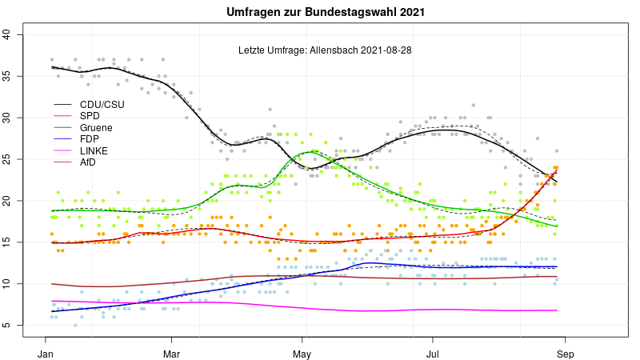

# Umfragen zur Bundestagswahl 2021

Hans W. Borchers  
*September 2021*

### Institute und letzte Umfragen

Eine Auswertung der Umfragen zur Bundestagswahl am 26. September 2021.

Stand: **Mo., 5. Sept. 2021**
*(Die Graphik wird in etwa jede Woche aktualisiert)*

Für die Umfragen der Wahlforschungs-Institute nutzen wir die veröffentlichten Daten auf [wahlrecht.de](https://www.wahlrecht.de/) ab Januar 2021.\
Die acht beteiligten Institute sind:

| Institut                 | Auftraggeber                    | # Umfragen |
|:-------------------------|:--------------------------------|-----------:|
| Allensbach               | FAZ                             |         10 |
| Kantar Emnid             | BamS                            |         34 |
| Forsa                    | stern-RTL                       |         37 |
| Forschungsgruppe Wahlen  | ZDF Politbarometer              |         14 |
| GMS                      | SAT1                            |          6 |
| Infratest Dimap          | ARD Deutschlandtrend            |         17 |
| INSA                     | Bild                            |         57 |
| YouGov                   | Redaktionsnetzwerk Deutschland  |         10 |

Die letzten Umfragen pro Institut haben zu folgenden Ergebnissen geführt:

|      Datum | CDUCSU |  SPD | Gruene |  FDP  | LINKE |  AfD |   Institut |
|:-----------|-------:|-----:|-------:|------:|------:|-----:|-----------:|
| 2021-07-27 |  21.0  | 23.0 |  18.0  |  12.0 |  6.0  | 11.0 |        GMS |
| 2021-08-28 |  26.0  | 24.0 |  17.0  |  10.5 |  6.0  | 10.5 | Allensbach |
| 2021-08-31 |  22.0  | 23.0 |  18.0  |  12.0 |  6.0  | 10.0 |      Forsa |
| 2021-09-02 |  21.0  | 25.0 |  19.0  |  11.0 |  7.0  | 11.0 |      Emnid |
| 2021-09-02 |  20.0  | 25.0 |  16.0  |  13.0 |  6.0  | 12.0 |  Infratest |
| 2021-09-03 |  22.0  | 25.0 |  17.0  |  11.0 |  7.0  | 11.0 |  ForWahlen |
| 2021-09-03 |  20.0  | 25.0 |  15.0  |  13.0 |  8.0  | 12.0 |     Yougov |
| 2021-09-04 |  20.0  | 25.0 |  16.0  |  13.0 |  7.0  | 12.0 |       INSA |

Die Daten werden jeweils aktuell und online aus den Tabellen auf 'wahlrecht.de' gezogen und mit R weiter verarbeitet. Die Grahik wird mit Base R Plot Routinen erzeugt (eine interaktive Version mit 'ggplo2' und 'plotly' könnte folgen).

### Glättung der Umfrage-Ergebnisse

Die folgende Grafik zeigt Ergebnisse der einzelnen Umfragen für die Parteien und Gättungskurven für den Verlauf. Die durchgezogenen Linien folgen Friedman's *Supersmoother* (in R als Funktion `supsmu`), die gestrichelten Linien durch *Gauss'sche Prozesse* berechnete Approximationen (die besonders am Ende unterschiedlich sein können).

(Die Einzelergebnisse für AfD und DieLinke sind nicht eingezeichnet, um die Grafik im unteren Bereich nicht zu überlasten.)

### Stimmen und Koalitionen

Aus diesen letzten Ergebnissen ergibt sich folgende Schätzung der prozentualen Stimmen und der Stimmenverteilung.

| Partei    | Anteil Stimmen | Sitze Bundestag|
|----------:|---------------:|---------------:|
| CDU/CSU   | 20.5 % | 155 |
| SPD       | 25   % | 188 |
| B90/Grüne | 17   % | 128 |
| FDP       | 12   % |  91 |
| DieLinke  |  7   % |  52 |
| AfD       | 11.5 % |  86 |
| Sonstige  |  7   % |   - |

Die Sitzverteilung ist dabei gerechnet mit etwa 700 Plätzen im Bundestag und 6.5% abgegebener Stimmen für Parteien, die wegen der 5%-Hürde *nicht* in den Bundestag kommen. Die wahrscheinlich hohe Zahl an Überhangmandaten für die CDU/CSU wird nicht berücksichtigt.

Die "grosse Koalition" hat keine Mehrheit mehr (343/700), ebenso hätte eine Linkskoalition von SPD, Grünen und Linken nur knapp eine Mehrheit (368/700) -- aber: siehe Überhangmandate. Am wahrscheinlichsten erscheint eine Jamaica- oder Deutschland-Koalition.

| Koalition | Parteien | Anzahl stimmen | Bemerkung |
|:----------|:---------|:---------------|:----------|
| Ampel Koalition | SPD, Grüne, FDP | 407 |  |
| Jamaica Koalition (*) | CDU/CSU, Grüne, FDP | 374 |  |
| Deutschland Koalition | CDU/CSU, SPD, FDP | 434 |  |
| Kenia Koalition | CDU/CSU, SPD, Grüne | 471 | unwahrscheinlich |
| Linkskoalition | SPD, Grüne, DieLinke | 368 | knappe Mehrheit |
| Grosse Koalition | CDU/CSU, SPD | 343 | keine Mehrheit |
| Rot-Grün | SPD, Grüne | 343 | keine Mehrheit |

(*) auch "schwarze Ampel" oder kurz "Schwampel" genannt.

