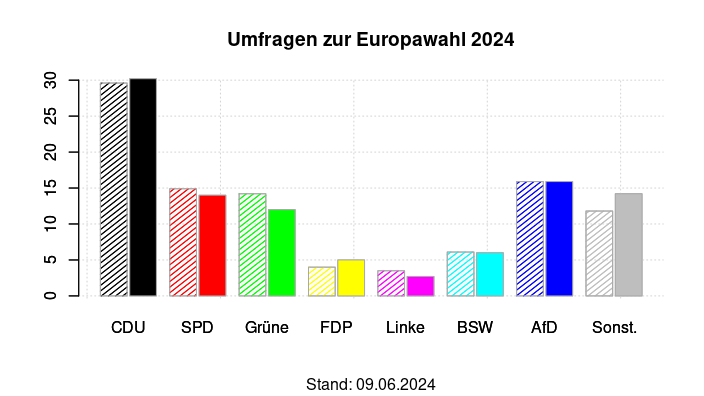

## Umfragen 2020-2024

*NEU: Umfragen zur Europawahl am 9. Juni 2024*


### Aktuelle Graphik


(*Diese Grafik wird hier zum Ende eines jeden Monats aktualisiert*)


### Einführung

In Deutschland finden mehrfach jede Woche Wahlumfragen zur Bundestagswahl statt. Die Frage an wahlberechtigte Bürger ist: "Wenn am nächsten Sonntag Bundestagswahl wäre, welche Partei würden Sie wählen?" Die wichtigsten beteiligten Umfrageinstitute sind wohl Allensbach, Verian (Emnid), Forsa, Forschungsgruppe Wahlen, GMS, Infratest Dimap, INSA und Yougov.

Die Daten aller dieser Institute werden auf der Plattform [Wahlrecht](https://www.wahlrecht.de/) veröffentlicht. Für die letzten aktuellen Umfragen siehe [Umfragen](https://www.wahlrecht.de/umfragen/). Die Art der Umfrage (Telefon, Online, ...) und die Anzahl der befragten Personen wird ebenfalls angegeben. Die Häufigkeit der Umfrage ist sehr unterschiedlich, zum Beispiel Allensbach nur einmal im Monat, INSA teilweise mehrfach pro Woche.


### Erläuterungen

Jeder Punkt (kleiner Kreis) ist *ein* Umfrageergebnis für *eine* Partei; zu jeder Umfrage gehören also sechs Punkte zum gleichen Datum. Die durchgezogene Linie ist eine **Glättung** der Daten zu einer Partei, hier generiert mit Friedman's *SuperSmoother* (eine Glättung mit der *Lowess* Glättungsmethode würde eine fast identische Kurve erzeugen). Die Farben sind den Farben der jeweiligen Parteien angepasst.

Die gestrichelte, senkrechte Linie ist der Zeitpunkt der Bundestagswahl am 26.9.2021. Die darauf abgebildeten kleinen Quadrate markieren die offiziellen Endergebnisse der jeweiligen Parteien. Unten ist die "5-Prozent Hürde" eingezeichnet. Die letzten Umfragen vor dem Wahltag haben das Endergebnis der Bundestagswahl 2021 (im Mittel aller Umfragen) relativ gut vorausgesagt.


### Auswertung

Die Ergebnisse der letzten Umfragen pro Institut ergeben

```
       Datum CDUCSU  SPD Gruene FDP LINKE  AfD   Institut
1 2024-05-02   31.0 15.0     15   5     -  18  Infratest
2 2024-05-07   31.0 15.0     14   4     2  18        GMS
3 2024-05-10   30.0 16.0     14   4     4  19     Yougov
4 2024-05-17   30.0 16.0     14   5     4  16      Emnid
5 2024-05-17   31.0 15.0     13   5     4  16  ForWahlen
6 2024-05-24   32.5 17.5     13   6     3  14 Allensbach
7 2024-05-28   30.0 16.0     13   6     -  15      Forsa
8 2024-05-28   30.5 15.0     12   5     3  17       INSA
```

Der Median der Umfragen aus den letzten vier Wochen ergibt eine gute Übereinstimmung mit dem letzten geglätteten Wert (dem Ende der geglätteten Linien in der Abbildung oben).

```
CDUCSU    SPD Gruene    FDP  LINKE    AfD 
  30.8   15.5   13.5    5.0    3.5   16.5  (median)
  30.8   15.7   13.5    5.0    3.3   16.6  (mean)
```

Die Anzahl der Umfragen pro Institut weist grosse Unterschiede zwischen den einzelnen Instituten auf: Allensbach zum Beispiel hat wahlberechtigte Bürger im Jahr 2023 nur einmal im Monat befragt, INSA dagegen zweimal (!) jede Woche.

```
Allensbach  Emnid  Forsa  ForWahlen  GMS  Infratest  INSA  Yougov 
        12     50     50         18    8         24   104      12
```

Der Einfluss dieser Institute auf die Glättung der Kurve und auf den aktuellen Median der Umfragen ist damit sehr unterschiedlich.


## Europawahl 2024

Speziell auf die Europawahl ausgerichtete Umfragen gibt es nicht viele, das sind 15 Umfragen in diesem Jahr, davon die Hälfte durch INSA. Eine Grafik wie oben macht daher nicht viel Sinn. Stattdessen verwenden wir eine gewichtete Mittelbildung, die neueren Umfragen werden dabei höher gewichtet als solche, die mehrere Monate alt sind.

```
           CDU     SPD   Grüne     FDP   Linke     BSW     AfD  Sonstige
Ende Mai  29.6    14.9    14.2     4.0     3.5     6.1    15.9      11.8
Trend     +0.3    -0.4    +0.8     0.0    -0.2    +0.2    -0.9      +0.2
Ergebnis
```



Der Trend bezieht sich auf ein lineares Modell der Umfragewerte, bezogen auf den 9. Juni 2024, den Tag der Wahl. Das Balkendiagramm stellt diese vorhergesagten prozentualen Anteile dar.

Die Standardabweichung in diesen Daten ist beträchtlich, sie beträgt zum Beispiel für die CDU/CSU 1.8, für die Grünen sogar 2.1 Prozentpunkte. Die hohe Standardabweichung der AfD von 2.4 ist eine Folge des Einbruchs der Umfragen in den letzten Wochen und Monaten.
