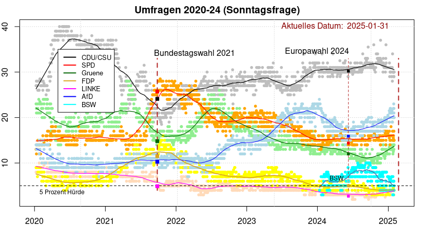
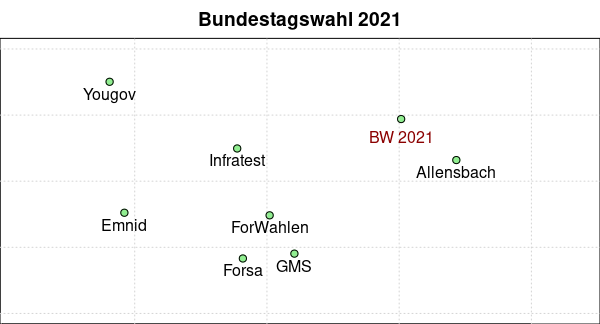
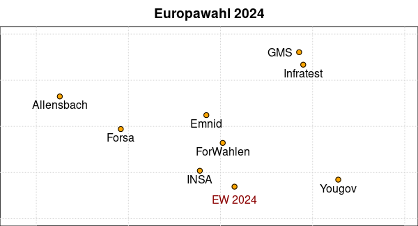

## Umfragen 2020-2024


### Aktuelle Graphik



(*Diese Grafik wird drei Wochen vor der Wahl noch einmal aktualisiert*)

### Auswertung

Die Umfragen aus den letzten vier Wochen ergeben eine gute Übereinstimmung mit dem
letzten geglätteten Wert (dem Ende der geglätteten Linien in der Abbildung oben).

```
        CDUCSU    SPD   Gruene    FDP   LINKE    AfD   BSW  Sonst.
------------------------------------------------------------------
          30.3   15.7     13.6    3.9     4.5   20.9   4.7    6.4
```

Die einzelnen Ergebnisse der letzten Umfragen pro Institut lauten

```
Datum        CDUCSU   SPD   Gruene   FDP   LINKE   AfD   BSW    Institut
------------------------------------------------------------------------
1 2025-01-23     34    17     13.5     4    --      20     5  Allensbach
2 2025-01-28     30    16     14.0     4     4      20     3       Forsa
3 2025-01-29     29    15     13.0     3     5      23     6      Yougov
4 2025-01-30     30    15     15.0     4     5      20     4   Infratest
5 2025-01-30     29    15     14.0     4     5      21     4   ForWahlen
6 2025-01-31     30    15     14.0     4     4      20     5       Emnid
7 2025-02-01     30    17     12.0     4     4      22     6        INSA
```

### Sitzverteilung

Wenn FDP, Linke und BSW nicht in den Bundestag kämen (Fall 1), entfielen 
zusammen mit den Sonstigen 15.4% der Stimmen. Für eine Mehrheit einer Koalition 
reichten dann etwa 43.5% der abgegebenen Stimmen. Die Koalitionen CDU/CSU+SPD 
und CDU/CSU+Grüne wären möglich.

Nehmen wir an, eine der beiden kleinen Parteien (FDP oder Linke) käme mit 5% 
knapp in den Bundestag (Fall 2), dann entstünde eine Situation wie in der 
folgenden Tabelle beschrieben. Die Mehrheit von CDU/CSU und Grünen stünde damit 
auf der Kippe (301von 600 Sitzen im Bundestag).

Hypothetische Sitzverteilung im Bundestag 2025:

```
             Fall 1       Sitze  | Fall 2       Sitze
    -------------------------------------------------
    CDU/CSU:      37.4 %    224  |      35.3 %    212
    SPD:          18.7 %    112  |      17.7 %    106
    Grüne:        15.6 %     94  |      14.8 %     89
    AfD:          22.0 %    132  |      20.7 %    124
    BSW:           6.3 %     38  |       6.0 %     36
    FDP o. Linke    --       --  |       5.5 %     33
```

Wenn die Linkspartei mit drei Direktmandaten und etwa 3-4 % in den Bundestag 
kommt, ändert sich gegenüber Fall 2 nur wenig. Und wenn drei kleine Parteien in 
den Bundestag kommen, funktioniert wahrscheinlich nur noch eine grosse 
Koalition.

### Erläuterungen

In Deutschland finden mehrfach jede Woche Wahlumfragen zur Bundestagswahl statt. Die Frage an wahlberechtigte Bürger ist: "Wenn am nächsten Sonntag Bundestagswahl wäre, welche Partei würden Sie wählen?" Die wichtigsten beteiligten Umfrageinstitute sind wohl Allensbach, Verian (Emnid), Forsa, Forschungsgruppe Wahlen, GMS, Infratest Dimap, INSA und Yougov.

Die Daten aller dieser Institute werden auf der Plattform [Wahlrecht](https://www.wahlrecht.de/) veröffentlicht. Für die letzten aktuellen Umfragen siehe [Umfragen](https://www.wahlrecht.de/umfragen/). Die Art der Umfrage (Telefon, Online, ...) und die Anzahl der befragten Personen wird ebenfalls angegeben. Die Häufigkeit der Umfrage ist sehr unterschiedlich, zum Beispiel Allensbach nur einmal im Monat, INSA teilweise mehrfach pro Woche.

Jeder Punkt (kleiner Kreis) ist *ein* Umfrageergebnis für *eine* Partei; zu jeder Umfrage gehören also acht Punkte zum gleichen Datum. Die durchgezogene Linie ist eine **Glättung** der Daten zu einer Partei, hier generiert mit Friedman's *SuperSmoother* (eine Glättung mit der *Lowess* Glättungsmethode würde eine fast identische Kurve erzeugen). Die Farben sind den Farben der jeweiligen Parteien angepasst.

Die gestrichelte, senkrechte Linie ist der Zeitpunkt der Bundestagswahl am 26.9.2021. Die darauf abgebildeten kleinen Quadrate markieren die offiziellen Endergebnisse der jeweiligen Parteien. Unten ist die "5-Prozent Hürde" eingezeichnet. Die letzten Umfragen vor dem Wahltag haben das Endergebnis der Bundestagswahl 2021 (im Mittel aller Umfragen) relativ gut vorausgesagt.

### Vergleich der Institute

Wie gut haben die verschiedenen Umfrage-Institute die Ergebnisse letzten Wahlen vorhergesagt? Dazu betrachten wir nur die Umfragen bis zu zwei Wochen vor dem Wahltermin. Für die Veranschaulichung der Differenzen benutzen wir die 'multidimensionale Skalierung' (MDS).

**Bundestagswahl 2021**

Für die Bundestagswahl im September 2021 liegen die folgenden zusammengefassten Umfragen von Anfang September bis zum 23.9. vor:

```
                CDU/CSU    SPD  Gruene    FDP  Linke    AfD
    -------------------------------------------------------
    Allensbach     25.0   26.0    16.0   10.5    5.0   10.0
    Emnid          20.5   25.0    16.5   11.0    6.5   11.5
    Forsa          22.0   25.0    17.0   11.5    6.0   10.5
    ForWahlen      22.5   25.0    16.5   11.0    6.0   10.5
    GMS            23.0   25.0    16.5   12.5    6.0   11.0
    Infratest      22.0   25.5    15.5   11.0    6.0   11.0
    Yougov         20.5   25.0    14.5   10.5    7.0   11.5
    -------------------------------------------------------
    Bundestags-    24.1   25.7    14.8   11.5    4.9   10.3
    wahl 2021
```



*Abb.*: MDS Vergleich der Bundestagswahl 2021

Allensbach hat deutlich die besseren Vorhersagen veröffentlicht. infratest dimap (ARD)  und die Forschungsgruppe Wahlen (ZDF) sind ebenfalls gut, Yougov und Emnid nicht, jedenfalls im Vergleich zu anderen.

**Europawahl 2024**

Für die Europawahl im Juni 2024 liegen die folgenden zusammengefassten Umfragen von Ende Mai bis zum 9. Juni vor:

```
                CDU/CSU    SPD  Gruene    FDP  Linke    AfD
    -------------------------------------------------------
    Allensbach     32.5   17.5    13.0    6.0    3.0   14.0
    Emnid          30.0   16.0    14.0    5.0    4.0   16.0
    Forsa          30.0   17.0    13.0    6.0     --   15.0
    ForWahlen      31.0   15.0    13.0    5.0    4.0   16.0
    GMS            31.0   15.0    14.0    4.0    2.0   18.0
    Infratest      31.0   15.0    14.0    4.0    3.0   18.0
    INSA           30.0   16.0    12.0    5.0    3.0   16.0
    Yougov         30.0   14.0    12.0    4.0    4.0   18.0
    -------------------------------------------------------
    Europawahl     30.2   14.4    12.0    5.0    2.7   15.9
    2024
```



*Abb.*: MDS Vergleich der Europawahl 2024

Wir können sehen, dass in diesem Fall INSA (einen Tag vor der Wahl) und die Forschungsgruppe Wahlen und Emnid (jeweils 22 Tage vor der Wahl) die besseren Prognosen erstellt haben. Allensbach (auch drei Wochen vor der Wahl) hatte eine deutlich ungenauere Voraussage geliefert, verglichen mit der Bundestagswahl 2021.


