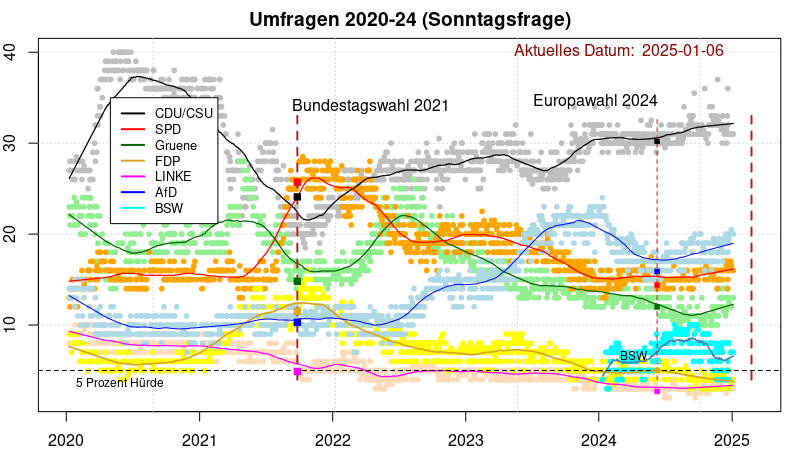

## Umfragen 2020-2024


### Aktuelle Graphik



(*Diese Grafik wird drei Wochen vor der Wahl noch einmal aktualisiert*)

### Auswertung

Die Umfragen aus den letzten vier Wochen ergeben eine gute Übereinstimmung mit dem
letzten geglätteten Wert (dem Ende der geglätteten Linien in der Abbildung oben).

```
        CDUCSU    SPD   Gruene   FDP   LINKE    AfD   BSW   Sonst.
------------------------------------------------------------------
          32.0   16.0     13.4   3.7     3.3   18.8   5.4     7.4
```

Die einzelnen Ergebnisse der letzten Umfragen pro Institut lauten

```
Datum       CDUCSU   SPD   Gruene   FDP   LINKE   AfD   BSW     Institut
------------------------------------------------------------------------
2024-12-05      30    18      13      4       3    19     7       Yougov
2024-12-19      33    14      14      3       3    19     5    Infratest
2024-12-20      31    17      14      4       3    18     5        Emnid
2024-12-20      31    15      14      3       4    19     5    ForWahlen
2024-12-20      36    16      12      4      NA    18     6   Allensbach
2024-12-23      31    16      13      3       4    19     4        Forsa
2025-12-03      33    16      13      4       3    18     4          GMS
2025-01-04      31    16      13      4       3    20     7         INSA
```

### Sitzverteilung

Wenn FDP, Linke und BSW *nicht* in den Bundestag kämen (Fall 1), entfielen zusammen mit den Sonstigen 15.4% der Stimmen. Für eine Mehrheit einer Koalition reichten dann 42.3% der abgegebenen Stimmen. Die Koalitionen CDU/CSU+SPD und CDU/CSU+Grüne wären möglich.

Nehmen wir an, eine der beiden kleinen Parteien (FDP oder Linke) käme mit 5% knapp in den Bundestag (Fall 2), dann entstünde eine Situation wie in der folgenden Tabelle beschrieben. Die Mehrheit von CDU/CSU und Grünen stünde damit auf der Kippe.

Hypothetische Sitzverteilung im Bundestag 2025:

```
             Fall 1       Sitze  | Fall 2       Sitze
    -------------------------------------------------
    CDU/CSU:      39.1 %    235  |      36.8 %    221
    SPD:          17.7 %    106  |      16.7 %    101
    Grüne:        14.5 %     87  |      13.7 %     82
    AfD:          21.4 %    128  |      20.2 %    121
    BSW:           7.3 %     44  |       6.9 %     42
    FDP o. Linke    --       --  |       5.6 %     33
```

Wenn die Linkspartei mit drei Direktmandaten und etwa 3-4 % in den Bundestag kommt, ändert sich gegenüber Fall 2 nur wenig.

### Erläuterungen

In Deutschland finden mehrfach jede Woche Wahlumfragen zur Bundestagswahl statt. Die Frage an wahlberechtigte Bürger ist: "Wenn am nächsten Sonntag Bundestagswahl wäre, welche Partei würden Sie wählen?" Die wichtigsten beteiligten Umfrageinstitute sind wohl Allensbach, Verian (Emnid), Forsa, Forschungsgruppe Wahlen, GMS, Infratest Dimap, INSA und Yougov.

Die Daten aller dieser Institute werden auf der Plattform [Wahlrecht](https://www.wahlrecht.de/) veröffentlicht. Für die letzten aktuellen Umfragen siehe [Umfragen](https://www.wahlrecht.de/umfragen/). Die Art der Umfrage (Telefon, Online, ...) und die Anzahl der befragten Personen wird ebenfalls angegeben. Die Häufigkeit der Umfrage ist sehr unterschiedlich, zum Beispiel Allensbach nur einmal im Monat, INSA teilweise mehrfach pro Woche.

Jeder Punkt (kleiner Kreis) ist *ein* Umfrageergebnis für *eine* Partei; zu jeder Umfrage gehören also acht Punkte zum gleichen Datum. Die durchgezogene Linie ist eine **Glättung** der Daten zu einer Partei, hier generiert mit Friedman's *SuperSmoother* (eine Glättung mit der *Lowess* Glättungsmethode würde eine fast identische Kurve erzeugen). Die Farben sind den Farben der jeweiligen Parteien angepasst.

Die gestrichelte, senkrechte Linie ist der Zeitpunkt der Bundestagswahl am 26.9.2021. Die darauf abgebildeten kleinen Quadrate markieren die offiziellen Endergebnisse der jeweiligen Parteien. Unten ist die "5-Prozent Hürde" eingezeichnet. Die letzten Umfragen vor dem Wahltag haben das Endergebnis der Bundestagswahl 2021 (im Mittel aller Umfragen) relativ gut vorausgesagt.

Die Anzahl der Umfragen pro Institut weist grosse Unterschiede zwischen den einzelnen Instituten auf: Allensbach zum Beispiel hat wahlberechtigte Bürger im Jahr 2023 nur einmal im Monat befragt, INSA dagegen zweimal (!) jede Woche.
