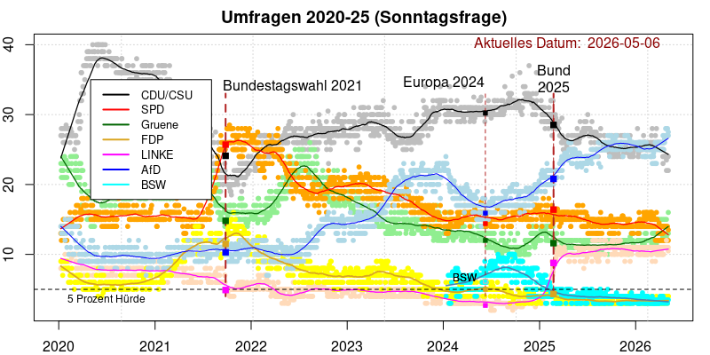

## Umfragen 2020-2026

### Aktuelle Graphik

(*Diese Grafik wird alle Vierteljahr oder vor einer Bundestags- oder Landtagswahl aktualisiert.*)

Die *Frankfurter Allgemeine* hat eine ähnliche, aber interaktive Grafik auf ihrer Seite [Wie stehen die Umfragen vor der Bundestagswahl?](https://www.faz.net/aktuell/politik/bundestagswahl/sonntagsfrage-zur-bundestagswahl-2025-wo-die-parteien-in-den-neuesten-wahlumfragen-stehen-19459939.html) veröffentlicht. Und ebenso die *ZEIT Online* mit [Wer führt in den altuellen Umfragen?](https://www.zeit.de/politik/deutschland/umfragen-bundestagswahl-neuwahl-wahltrend).

### Erläuterungen

In Deutschland finden mehrfach jede Woche Wahlumfragen zur Bundestagswahl statt. Die Frage an wahlberechtigte Bürger ist: "Wenn am nächsten Sonntag Bundestagswahl wäre, welche Partei würden Sie wählen?" Die wichtigsten beteiligten Umfrageinstitute sind wohl Allensbach, Verian (Emnid), Forsa, Forschungsgruppe Wahlen, GMS, Infratest Dimap, INSA und Yougov.

Die Daten aller dieser Institute werden auf der Plattform [Wahlrecht](https://www.wahlrecht.de/) veröffentlicht. Für die letzten aktuellen Umfragen siehe [Umfragen](https://www.wahlrecht.de/umfragen/). Die Art der Umfrage (Telefon, Online, ...) und die Anzahl der befragten Personen wird ebenfalls angegeben. Die Häufigkeit der Umfrage ist sehr unterschiedlich, zum Beispiel Allensbach nur einmal im Monat, INSA teilweise mehrfach pro Woche.

Jeder Punkt (kleiner Kreis) ist *ein* Umfrageergebnis für *eine* Partei; zu jeder Umfrage gehören also acht Punkte zum gleichen Datum. Die durchgezogene Linie ist eine **Glättung** der Daten zu einer Partei, hier generiert mit Friedman's *SuperSmoother* (eine Glättung mit der *Lowess* Glättungsmethode würde eine fast identische Kurve erzeugen). Die Farben sind den Farben der jeweiligen Parteien angepasst.

Die gestrichelte, senkrechte Linie ist der Zeitpunkt der Bundestagswahl am 26.9.2021. Die darauf abgebildeten kleinen Quadrate markieren die offiziellen Endergebnisse der jeweiligen Parteien. Unten ist die "5-Prozent Hürde" eingezeichnet. Die letzten Umfragen vor dem Wahltag haben das Endergebnis der Bundestagswahl 2021 (im Mittel aller Umfragen) relativ gut vorausgesagt.

